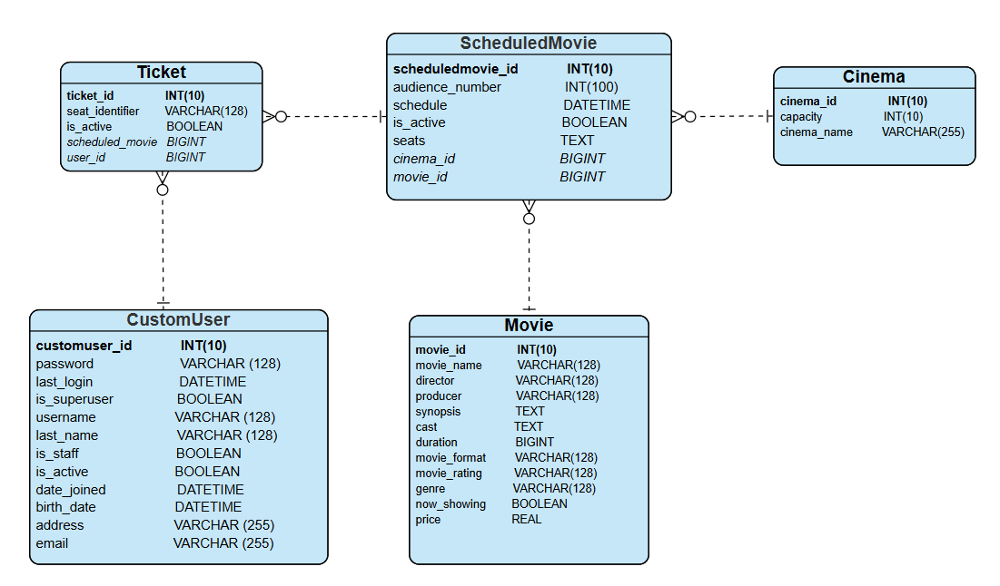
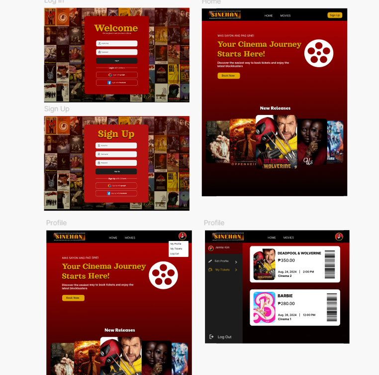
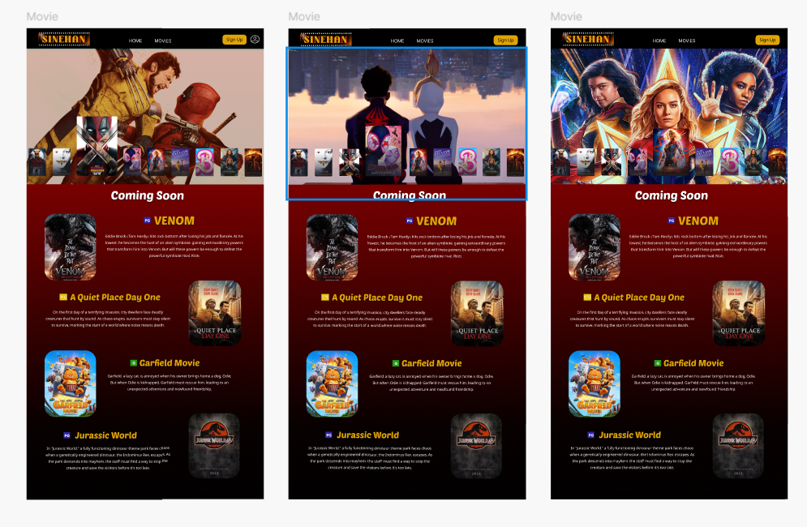
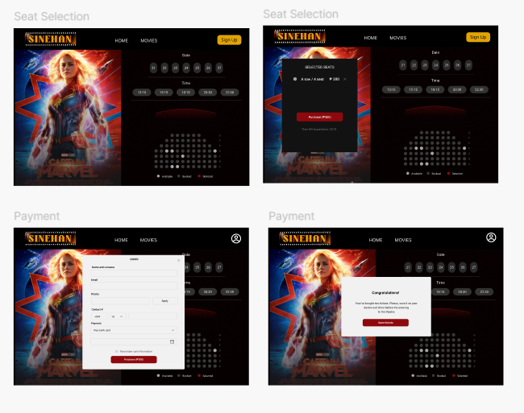

# 🎥 **SINEHAN**

_A simple and intuitive cinema ticketing system for steamlined movie-watching._

[](https://github.com/elib00/sinehan/graphs/contributors) [](https://github.com/elib00/sinehan/network) [](https://github.com/elib00/sinehan/stargazers) [](https://github.com/elib00/sinehan/issues) [](https://opensource.org/licenses)

## Table of Contents

<details>  
  <summary></summary>

- [Overview](#-overview)
- [Functional Requirements](#-functional-requirements)
- [Resources](#-resources)
  - [Gantt Chart](#-gantt-chart)
  - [ERD](#-erd)
  - [UI/UX Design](#-uiux-design)
- [Tech Stack](#-tech-stack)
- [Getting Started](#-getting-started)
  - [Prerequisites](#-prerequisites)
  - [Installation](#-installation)
- [Contributors](#-contributors)
- [Contact](#-contact)

</details>

---

## ✨ **Overview**

Sinehan is a modern cinema ticketing system crafted to deliver seamless ticket purchasing and management.

🎬 **Effortless Browsing**: Users can explore an updated catalog of films with details such as showtimes, genres, and ratings, ensuring informed decisions.

🎟 **Quick & Secure Ticketing**: Streamlined ticket purchasing allows seat selection and easy payment completion maintaining user convenience.

🍿 **Admin Efficiency**: Administrators managing essential operations, including adding/editing movie schedules, monitoring user activity, and tracking bookings.

<div align="right"><a href="#-sinehan">🔝 Back to Top</a></div>

---
## 🚀 **Functional Requirements**
1. **User Management**
   <details>
     <summary> </summary>

     - User can browse movies
     - User can search movies
     - User can filter movies by Genre, Rating, and Format
     - User can sort movies by runtime, price, and alphabetically
     - User can choose different views (tiled/grid)
     - User can view upcoming movies
     - User Registration
     - User Login
     - User Logout
     - Edit User Profile (Edit name, Email, Address, Birthdate)
     - Can view My Tickets
     - Convert Tickets to PDF (for printing)

   </details>

2. **Booking Management**
   <details>
     <summary> </summary>

     - Display Available Seats
     - User can select Cinema Number, Date, Time (Scheduled Movie)
     - User must select at least one seat to proceed to checkout

   </details>

3. **Movie Management**
   <details>
     <summary> </summary>

     - Create New Movie
     - Create Scheduled Movie
     - Soft Delete Existing Scheduled Movie
     - Update Date and Time of Scheduled Movie
     - Create Cinema
     - Create Ticket
     - Update Seat Identifier
     - Cancel a Ticket
     - Filter by All Tickets, Scheduled Movie, Users
     - Read Available Movies

   </details>

4. **Admin Tools**
   <details>
     <summary> </summary>

     - Create User Account
     - Read User Accounts
     - Update User Account

   </details>


<div align="right"><a href="#-sinehan">🔝 Back to Top</a></div>


---

## 📂 **Resources**

### **Gantt Chart**

- [Gantt Chart](static/SINEHAN%20Gantt%20Chart.pdf)

### **ERD**



### **UI/UX Design**

<div style="display: flex; gap: 10px;">





</div>

<div align="right"><a href="#-sinehan">🔝 Back to Top</a></div>

---

## 🛠️ **Tech Stack**

- [](https://www.djangoproject.com/)
- [](https://www.sqlite.org/)
- [](https://www.python.org/)
- [](https://developer.mozilla.org/en-US/docs/Web/HTML)
- [](https://developer.mozilla.org/en-US/docs/Web/CSS)
- [](https://developer.mozilla.org/en-US/docs/Web/JavaScript)
- [](https://tailwindcss.com/)

<div align="right"><a href="#-sinehan">🔝 Back to Top</a></div>

---

## 🍿 **Getting Started**

### 📦 **Prerequisites**

Before you start, ensure you have the following installed:

- [](https://www.python.org/)

<div align="right"><a href="#-sinehan">🔝 Back to Top</a></div>

### 🛠️ **Installation**

1. **Clone the repository**  
   Open your terminal and run the following command:

   ```bash
   git clone https://github.com/elib00/sinehan.git
   cd sinehan
   ```

2. **Create a virtual environment**  
   It’s recommended to create a virtual environment to manage dependencies:

   ```bash
   python -m venv venv
   ```

   Activate the virtual environment:

   - On **macOS/Linux**:
     ```bash
     source venv/bin/activate
     ```
   - On **Windows**:
     ```bash
     venv\Scripts\activate
     ```

3. **Install dependencies**  
   Install all the required packages from `requirements.txt`:

   ```bash
   pip install -r requirements.txt
   ```

4. **Apply database migrations**  
   Run the database migrations to set up the database schema:

   ```bash
   python manage.py make migrations
   python manage.py migrate
   ```

5. **Start the development server**  
   Now, you can start the development server and view the project locally:

   ```bash
   python manage.py runserver
   ```

6. **Access the application**  
   Open your browser and go to `http://127.0.0.1:8000/` to see the application running locally.

<div align="right"><a href="#-sinehan">🔝 Back to Top</a></div>

---

## 👨‍💻 **Contributors**

**Our Amazing Contributors! ✨**

<div align="center">

|  |  |  |
| ----------------------------------------------------------------------------------------------------------------------------- | ---------------------------------------------------------------------------------------------------------------------------------- | ------------------------------------------------------------------------------------------------------------------------------------ |
| **Joshua Napiñas**                                                                                                            | **Summer Ishi Rodrigo**                                                                                                            | **Zhazted Rhixin Valles**                                                                                                            |

</div>

<div align="right"><a href="#-sinehan">🔝 Back to Top</a></div>

---

## 📬 **Contact**

For inquiries, feel free to contact us:

- 📧 **Email**: [joshuanapinas@gmail.com](joshuanapinas@gmail.com)
- 📌 **GitHub**: [elib00](https://github.com/elib00)

- 📧 **Email**: [summerrodrigo07@gmail.com](summerrodrigo07@gmail.com)
- 📌 **GitHub**: [SummerIshi](https://github.com/SummerIshi)

- 📧 **Email**: [vallestedted@gmail.com](vallestedted@gmail.com)
- 📌 **GitHub**: [Rhixin](https://github.com/Rhixin)

<div align="right"><a href="#-sinehan">🔝 Back to Top</a></div>
